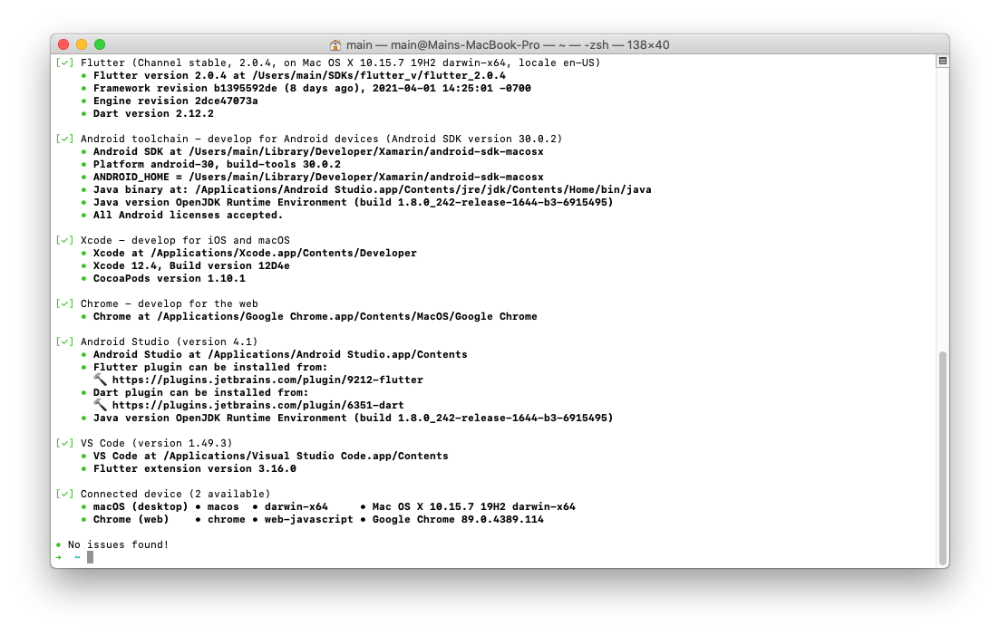
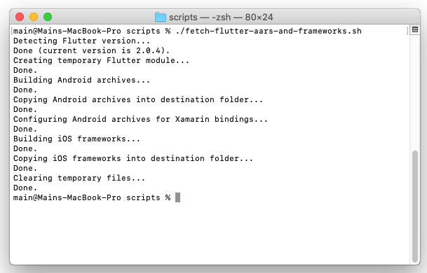
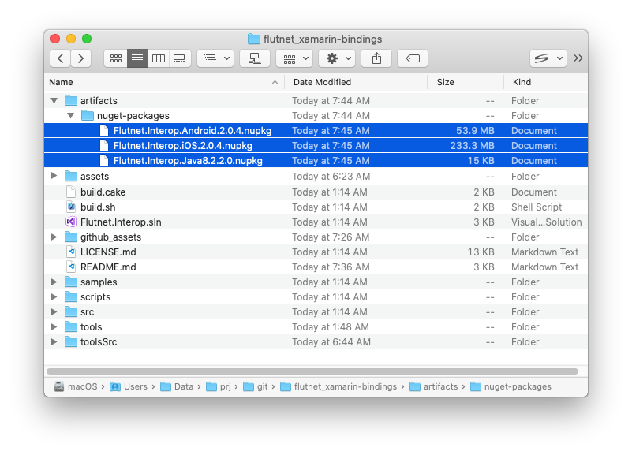

# Flutnet Xamarin Bindings

[](https://www.gnu.org/licenses/lgpl-3.0)

| Flutnet.Interop.Android                                                                                                     | Flutnet.Interop.iOS                                                                                                 |
| --------------------------------------------------------------------------------------------------------------------------- | ------------------------------------------------------------------------------------------------------------------- |
| [](https://www.nuget.org/packages/Flutnet.Interop.Android/) | [](https://www.nuget.org/packages/Flutnet.Interop.iOS/) |

This repository holds the Xamarin bindings for Flutter engine's embedding APIs. These APIs let a Flutter module to be imported into an existing Android or iOS app: please read through the [official Flutter documentation](https://flutter.dev/docs/development/add-to-app) for a deeper look at this feature.

The Xamarin bindings are used to integrate a Flutter module into a Xamarin app. The bindings themselves are published on [NuGet Gallery](https://www.nuget.org/) with the names [Flutnet.Interop.Android](https://www.nuget.org/packages/Flutnet.Interop.Android/) and [Flutnet.Interop.iOS](https://www.nuget.org/packages/Flutnet.Interop.iOS/).

  - [What is Flutnet?](#what-is-flutnet)
  - [System requirements](#system-requirements)
  - [Building procedure](#building-procedure)
  - [Sample app](#sample-app)
  - [Contributing](#contributing)
  - [License](#license)

## What is Flutnet?

Flutnet is a set of tools and libraries that allows you to create rich and beautiful Xamarin apps using [Flutter](https://flutter.dev/) as UI Layer and .NET as backend. For more details please visit https://www.flutnet.com/.

<div style="background-color:white; padding:0%; margin-bottom: 3%;">


</div>

## System requirements

To build and run the source projects and the sample apps, you need a **macOS** properly configured
 with:
- Xamarin (Visual Studio 2019 for Mac version 8.9.5 or later)
- Xcode with Command Line Tools (version 12.3 or later)
- Flutter SDK (version 2.0.4 or later)

For specific instructions on how to install and configure Flutter please refer to: 

- The official [Flutter installation guide](https://flutter.dev/docs/get-started/install/macos)
- The [Flutnet documentation page](https://www.flutnet.com/Documentation/Getting-Started/Install-on-macOS) (you can skip the last section _Installing Flutnet SDK_)

To check if Flutter is correctly installed run:

```sh
flutter doctor -v
```




## Building procedure

 1. [Fetch Flutter's Android archives and iOS frameworks](#fetch-flutters-android-archives-and-ios-frameworks)
 2. [Build the source projects](#build-the-source-projects)
 3. [Create the NuGet packages](#create-the-nuget-packages)

### Fetch Flutter's Android archives and iOS frameworks

The first step is to retrieve and configure all the necessary native libs for Android and iOS that will be embedded into Xamarin binding libraries. You need to run the following script:

```sh
scripts/fetch-flutter-aars-and-frameworks.sh
```



This script will call the custom tool `tools/FlutterSync/FlutterSync` whose tasks are:
- Create a temporary Flutter module
- Build the module to produce the .aars and .xcframeworks for Flutter engine's embedding APIs
- Manipulate the output in a way that all the necessary native libs can be properly referenced and embedded into the Xamarin bindings projects

The archives and frameworks will be placed into `assets/xamarin-native-references/` folder. Given their size, they have been excluded from version control.

> `FlutterSync` is a Console application targeting .NET Core 3.1. You can customize or improve the tool by working on  `toolsSrc/FlutterSync.sln` solution. Once you've finished, just run the following script to update the executables under  `tools/` folder:
> ```sh
> scripts/rebuild-and-update-tools.sh
> ```

### Build the source projects

The following script will build all the projects within the `Flutnet.Interop.sln` solution, restoring all the required NuGet packages:

- `src/Flutnet.Interop.Android`
- `src/Flutnet.Interop.iOS`
- `src/Flutnet.Interop.Java8`

```sh
scripts/build-src.sh
```

>You can always compile the .sln file in a IDE. Please make sure to build both `ReleaseWithDebugNativeRef` and `Release` configurations before moving on to the next step.

### Create the NuGet packages

Once the Xamarin bindings have been built, run the following script to create the corresponding NuGet packages:

```sh
scripts/pack.sh
```

All the packages will be placed into `artifacts/nuget-packages/` folder.



**NOTE**

The version of `Flutnet.Interop.Android` and `Flutnet.Interop.iOS` packages should match the version of Flutter SDK these libraries are referencing/embedding. 

If you intend to generate bindings on a newer version of Flutter (i.e. 2.0.6), please update the `.nuspec` files accordingly (i.e. `<version>2.0.6</version>`). 

On the other hand, if you need to fix the existing bindings, please update the `.nuspec` files by specifying/incrementing the 4th version component (i.e. `<version>2.0.5.1</version>`, `<version>2.0.5.2</version>` etc).

## Sample app

### Overview

Folder `samples/` contains a basic example that illustrates how to integrate a Flutter module into a Xamarin.Android and a Xamarin.iOS app through the Flutnet.Interop bindings libraries. In this folder you can find:

- A basic Flutter module (`flutter_module/`) created with command:

```sh
flutter create -t module flutter_module
```

- A Visual Studio solution (`Flutnet.Interop.Samples.sln`) containing: 
  - A Xamarin.Android app (`Flutnet.Interop.Sample.Android`)
  - A Xamarin.iOS app (`Flutnet.Interop.Sample.iOS`)
  - A further Xamarin.Android bindings library (`Flutnet.ModuleInterop.Android`) needed to embed the AAR representing the UI of the Flutter module

### Preliminary steps

To ensure we're using the latest NuGet Packages, we can clean the NuGet cache first by running:

```sh
scripts/clear-nuget-cache.sh
```

Now we can run:

```sh
scripts/build-samples.sh
```

This script will perform the following tasks:
- Build the Flutter module
- Restore all the required NuGet packages for the sample solution
- Build all the projects within the solution

### Run the sample

Once the script has completed, you can open the `samples/Flutnet.Interop.Samples.sln` solution in your IDE and start debugging both the Xamarin.Android and the Xamarin.iOS app in a simulator or on a real device.

>The projects in this repository reference by default the _Flutnet.Interop_ packages that are published on NuGet Gallery. If you want the sample to reference your own bindings (i.e. local NuGet packages that you built on your own), please edit the `samples/NuGet.Config` file and/or the `<PackageReference>` inside each `.csproj` accordingly.

## Contributing

Pull requests are welcome. For major changes, please open an issue first to discuss what you would like to change.

## License

This project is licensed under the LPGL v3 license (https://www.gnu.org/licenses/lgpl-3.0.html)
