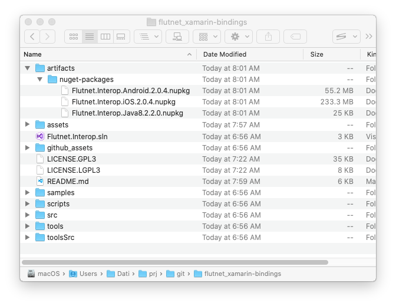

# [Flutnet](https://www.flutnet.com) Xamarin Bindings

This repository provides all the code to build your own nuget packages

- [Flutnet.Interop.iOS](https://www.nuget.org/packages/Flutnet.Interop.iOS/)
- [Flutnet.Interop.Android](https://www.nuget.org/packages/Flutnet.Interop.Android/) 
 
that allow to embed [Flutter](https://flutter.dev/) inside your Xamarin project (Android and iOS only).

## What is Flutnet?

Flutnet is a set of tools and libraries that will make super easy embed Flutter (graphical framework) inside a Xamarin application (as a backend layer) to obtain a powerful and native cross platform application. For more detailts see https://www.flutnet.com/.

## Setup requirements

Before following all the instructions in the next chapters, you need to have your system property configured. The system needs to have installed 
- Xamarin Android/iOS
- (ONLY for Mac) Visual Studio for Mac version 8.9.5 (Xamarin iOS 14.14.2.5)
- Flutter 2.0.4
- Configured the Enviroment


For Specific instructions see 

- [Windows Enviroment Setup](https://www.flutnet.com/Documentation/Getting-Started/Install-on-Windows) (Skip the section **Installing Flutnet SDK**)
- [macOS Enviroment Setup](https://www.flutnet.com/Documentation/Getting-Started/Install-on-macOS) (Skip the section **Installing Flutnet SDK**)
- Ensure to install [Flutter 2.0.4](https://flutter.dev/docs/get-started/install)

> This guide Refer to Flutter 2.0.4: ensure to install this specific version.

To check if Flutter is correrctly installed run

```sh
flutter doctor -v
```


## Build procedure :hammer:

The following procedure refer to a **macOS system**, because we need a macOS machine in order to build both Android and iOS. 
> Using a Windows machine you'll be able to build only the Android nuget package.

The build process will perform in 3 steps:
 1. [Fetch Flutter aar* libraries (Android) and frameworks (iOS)](#1-fetch-flutter-aar-libraries-android-and-frameworks-ios)
 2. [Build src projects](#2-build-src-projects)
 3. [Create the nuget packages](#3-create-the-nuget-packages)

### Fetch Flutter aar* libraries (Android) and frameworks (iOS)

The first step is to retrieve all the necessary libs and frameworks that will be used for both __Flutnet.Interop.iOS__ and __Flutnet.Interop.Android__ binding libraries. 

The first script the we'll execute, rely on the `tool/FlutterSync/FlutterSync` command: its goal is to create a [Flutter Module project](https://flutter.dev/docs/development/add-to-app) and retrieve all the libraries used into the Binding projects.

> NOTE: if you want to customize the `FlutterSync` tool, just edit the source code from `toolsSrc/FlutterSync.sln` and rebuild the project running
> ```sh
> scripts/rebuild-and-update-tools.sh
> ```

Run

```sh
scripts/fetch-flutter-aars-and-frameworks.sh
```


Libraries and framework will be moved inside the `assets/` folder.




### Build src projects

The following script will build all the projects inside the solution file `Flutnet.Interop.sln`:

- `src/Flutnet.Interop.Android`
- `src/Flutnet.Interop.iOS`
- `src/Flutnet.Interop.Java8`

```sh
scripts/build-src.sh
```

When the build process has finished we can generate the corrisponding Nuget packages.

### Create the nuget packages

From the projects already builded we now can create the nuget packages. All the packages will be plased inside `artifacts/nuget-packages/` folder.

Run
```sh
scripts/pack.sh
```


## Run a flutter Counter app using the NuGet packages

After building the nuget packages 

- Flutnet.Interop.Android.2.0.4.nupkg
- Flutnet.Interop.iOS.2.0.4.nupkg
- Flutnet.Interop.Android.2.0.4.nupkg
  
we can now execute a basic sample project, where the Xamarin Application will run having inside itself the Flutter Module project `samples/flutter_module`.

### Clean the Nuget Cache

To ensure using the latest Nuget Packages we can clean the NuGet cache.

```sh
scripts/clear-nuget-cache.sh
```

### Build the sample project

The first step to run the sample project is to build the flutter module project in the `samples/flutter_module` folder.

Run
```sh
scripts/build-samples.sh
```

If the build succeeds the nuget packages are correctly generated and everythings works as expected.

>NOTE: Visual studio know where to find the nuget packages because the information is indicated inside the `samples/NuGet.Config` file.

### Run the project on a device

After that the last thing to do is to open the `samples/Flutnet.Interop.Samples.sln` in visual studio running the project.

